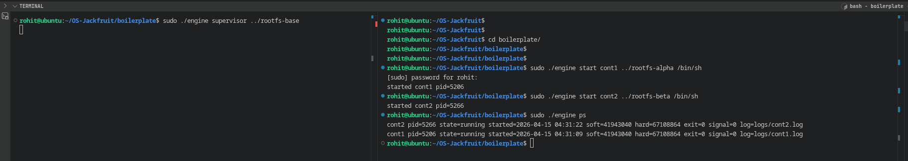
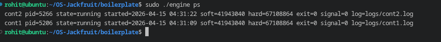
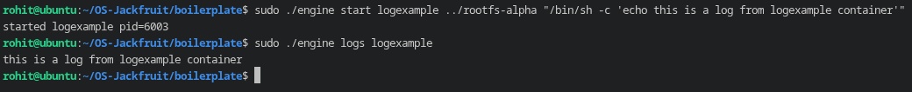
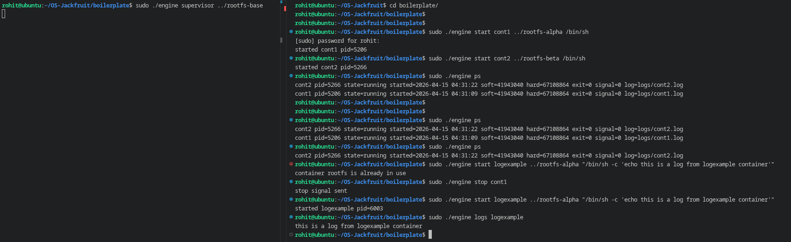
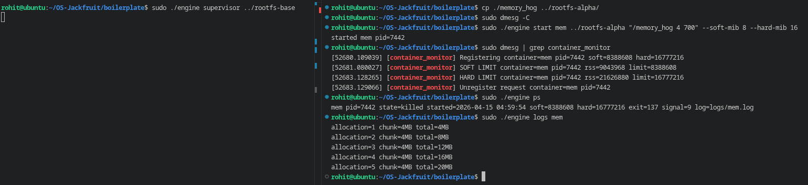
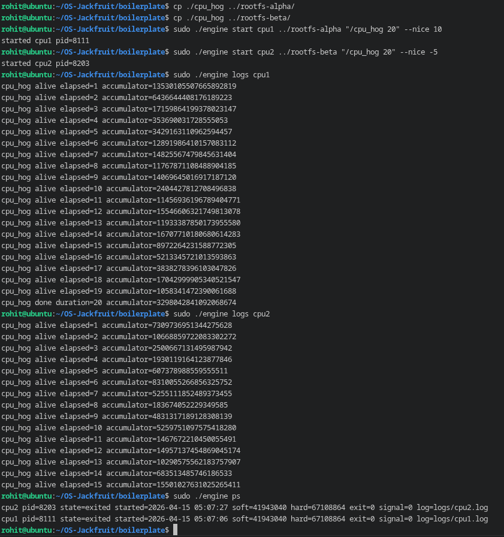
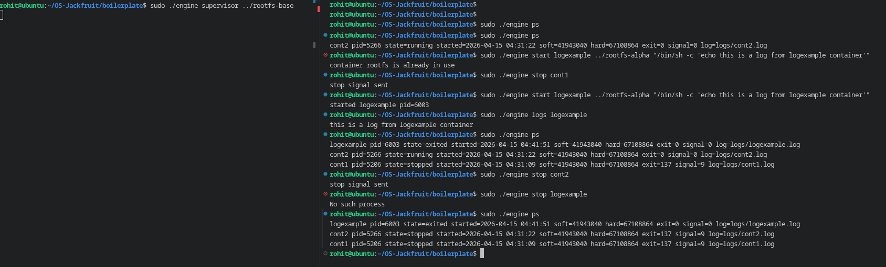

# Multi-Container Runtime

## Team Information

- Name 1: `Rohit Pujari` - SRN 1: `PES1UG25CS836`
- Name 2: `Sami Nisar Shahapuri` - SRN 2: `PES1UG24CS611`

## Project Overview

This project implements a lightweight Linux container runtime in C with two connected components:

- A user-space supervisor in `boilerplate/engine.c`
- A kernel memory monitor in `boilerplate/monitor.c`

The supervisor runs as a long-lived parent process, accepts CLI commands over a UNIX domain socket, launches multiple containers using Linux namespaces, captures container output through a bounded-buffer logging pipeline, and keeps metadata for all tracked containers.

The kernel module exposes `/dev/container_monitor` and accepts container registration requests through `ioctl`. It tracks host PIDs, emits a warning when a process crosses a soft memory limit, and kills the process when it crosses the hard limit.

## Features Implemented

- Multi-container supervisor model with one long-running parent process
- Namespace isolation using PID, UTS, and mount namespaces
- `chroot`-based filesystem isolation per container rootfs
- `/proc` mounted inside each container
- CLI commands: `supervisor`, `start`, `run`, `ps`, `logs`, `stop`
- UNIX domain socket control plane between CLI clients and the supervisor
- Pipe-based logging path from container stdout/stderr into the supervisor
- Bounded-buffer logging with producer/consumer synchronization
- Persistent per-container log files under `boilerplate/logs/`
- Kernel memory monitor with soft-limit warning and hard-limit kill
- Workloads for memory, CPU, and I/O experiments

## Repository Layout

- `boilerplate/engine.c`: user-space runtime and supervisor
- `boilerplate/monitor.c`: kernel module for memory monitoring
- `boilerplate/monitor_ioctl.h`: shared ioctl definitions
- `boilerplate/memory_hog.c`: memory pressure workload
- `boilerplate/cpu_hog.c`: CPU-bound workload
- `boilerplate/io_pulse.c`: I/O-oriented workload
- `boilerplate/Makefile`: build targets for user space and kernel module
- `project-guide.md`: original project specification

## Environment

Tested on:

- Ubuntu 22.04/24.04 VM
- Secure Boot disabled

Required packages:

```bash
sudo apt update
sudo apt install -y build-essential linux-headers-$(uname -r)
```

## Build Instructions

Build user-space binaries and the kernel module:

```bash
cd boilerplate
make
```

CI-safe compile-only check:

```bash
make ci
```

This builds:

- `engine`
- `memory_hog`
- `cpu_hog`
- `io_pulse`

## Root Filesystem Setup

Create the Alpine root filesystem template:

```bash
cd ..
mkdir rootfs-base
wget https://dl-cdn.alpinelinux.org/alpine/v3.20/releases/x86_64/alpine-minirootfs-3.20.3-x86_64.tar.gz
tar -xzf alpine-minirootfs-3.20.3-x86_64.tar.gz -C rootfs-base
```

Create writable copies for each live container:

```bash
cp -a ./rootfs-base ./rootfs-alpha
cp -a ./rootfs-base ./rootfs-beta
```

Copy workloads into the rootfs copies before using them:

```bash
cp ./boilerplate/memory_hog ./rootfs-alpha/
cp ./boilerplate/cpu_hog ./rootfs-alpha/
cp ./boilerplate/cpu_hog ./rootfs-beta/
cp ./boilerplate/io_pulse ./rootfs-alpha/
cp ./boilerplate/io_pulse ./rootfs-beta/
```

## Load and Unload the Kernel Module

Load the memory monitor:

```bash
cd boilerplate
sudo insmod monitor.ko
ls -l /dev/container_monitor
```

Unload the module:

```bash
sudo rmmod monitor
```

If `insmod` reports `File exists`, the module is already loaded. In that case:

```bash
lsmod | grep monitor
```

## Starting the Supervisor

Start the supervisor after the module is loaded:

```bash
cd boilerplate
sudo ./engine supervisor ../rootfs-base
```

Important: start the supervisor only after `/dev/container_monitor` exists. Otherwise the supervisor cannot register containers with the monitor.

## CLI Usage

Canonical command interface:

```bash
./engine supervisor <base-rootfs>
./engine start <id> <container-rootfs> <command> [--soft-mib N] [--hard-mib N] [--nice N]
./engine run   <id> <container-rootfs> <command> [--soft-mib N] [--hard-mib N] [--nice N]
./engine ps
./engine logs <id>
./engine stop <id>
```

## Example Run Sequence

Start two containers:

```bash
sudo ./engine start alpha ../rootfs-alpha "/bin/sh -c 'echo alpha-start; sleep 30; echo alpha-end'"
sudo ./engine start beta ../rootfs-beta "/bin/sh -c 'echo beta-start; sleep 30; echo beta-end'"
sudo ./engine ps
sudo ./engine logs alpha
sudo ./engine logs beta
sudo ./engine stop alpha
sudo ./engine stop beta
```

Foreground run with exit status propagation:

```bash
sudo ./engine run gamma ../rootfs-alpha "/bin/sh -c 'echo run-test; exit 7'"
echo $?
```

Expected result:

- `run-test` appears in the log
- shell exit status is `7`

## Memory Monitor Demonstration

The following run was used to verify correct soft and hard limit handling:

```bash
cp ./memory_hog ../rootfs-alpha/
sudo dmesg -C
sudo ./engine start mem4 ../rootfs-alpha "/memory_hog 4 700" --soft-mib 8 --hard-mib 16
sleep 5
sudo dmesg | grep container_monitor
sudo ./engine ps
sudo ./engine logs mem4
```

Observed behavior:

- registration message appeared in `dmesg`
- soft limit warning appeared after RSS crossed `8 MiB`
- hard limit event appeared after RSS crossed `16 MiB`
- the supervisor marked the container as `killed`

Sample observed output:

```text
[container_monitor] Registering container=mem4 pid=3460 soft=8388608 hard=16777216
[container_monitor] SOFT LIMIT container=mem4 pid=3460 rss=13107200 limit=8388608
[container_monitor] HARD LIMIT container=mem4 pid=3460 rss=17301504 limit=16777216
[container_monitor] Unregister request container=mem4 pid=3460
```

Supervisor metadata after the kill:

```text
mem4 pid=3460 state=killed started=2026-04-14 14:42:09 soft=8388608 hard=16777216 exit=137 signal=9 log=logs/mem4.log
```

## Scheduler Experiment Setup

Two styles of experiments were prepared.

### Experiment 1: Two CPU-bound containers with different priorities

```bash
cp ./cpu_hog ../rootfs-alpha/
cp ./cpu_hog ../rootfs-beta/

sudo ./engine start cpu1 ../rootfs-alpha "/cpu_hog 20" --nice 10
sudo ./engine start cpu2 ../rootfs-beta "/cpu_hog 20" --nice -5
sudo ./engine ps
sudo ./engine logs cpu1
sudo ./engine logs cpu2
```

What to compare:

- progress rate in the logs
- finish time
- whether the lower nice value gets more CPU share

### Experiment 2: CPU-bound vs I/O-oriented workload

```bash
cp ./io_pulse ../rootfs-alpha/
cp ./cpu_hog ../rootfs-beta/

sudo ./engine start io1 ../rootfs-alpha "/io_pulse 10 200"
sudo ./engine start cpu3 ../rootfs-beta "/cpu_hog 10"
sudo ./engine logs io1
sudo ./engine logs cpu3
```

What to compare:

- responsiveness of the I/O-heavy task
- progress behavior of the CPU-heavy task
- fairness and interactivity under concurrent load

## Screenshots

### 1. Multi-container supervision

File: `screenshots/01-multi-container.png`

Capture:

- supervisor running in one terminal
- two or more containers started from another terminal
- `./engine ps` showing at least two live containers


Two containers running under one supervisor process.



### 2. Metadata tracking

File: `screenshots/02-ps-metadata.png`

Capture:
- `./engine ps`
- visible fields for container ID, PID, state, limits, exit info, and log path



### 3. Bounded-buffer logging

File: `screenshots/03-logging.png`

Capture:

- a container that prints multiple lines
- `./engine logs <id>`
- optionally `ls boilerplate/logs` or `cat boilerplate/logs/<id>.log`



### 4. CLI and IPC

File: `screenshots/04-cli-ipc.png`

Capture:

- one terminal running the supervisor
- another terminal issuing a command like `start`, `ps`, or `stop`



### 5. Soft-limit warning

File: `screenshots/05-soft-hard-limit.png`

Capture:

- output of `sudo dmesg | grep container_monitor`



Place it in the `Memory Monitor Demonstration` section.

### 6. Hard-limit enforcement

File: `screenshots/05-soft-hard-limit.png`

Capture:

- `HARD LIMIT` line from `dmesg`
- `./engine ps` showing the container state as `killed`


### 7. Scheduling experiment

File: `screenshots/06-scheduler.png`

Capture:

- logs from `cpu1` and `cpu2`



### 8. Clean teardown

File: `screenshots/07-clean-teardown.png`

Capture:

- stopped/exited containers no longer running as host processes




## Engineering Analysis

### 1. Isolation Mechanisms

Each container is created with `clone()` using PID, UTS, and mount namespaces. PID namespaces give the container its own process numbering view, UTS namespaces isolate the hostname, and mount namespaces isolate the mount table so `/proc` can be mounted separately inside the container. Filesystem isolation is enforced with `chroot()` into a per-container writable rootfs copy. This prevents one live container from sharing the same writable filesystem state as another. The kernel itself is still shared by all containers, so process isolation here is namespace-based rather than a separate-kernel virtualization model.

### 2. Supervisor and Process Lifecycle

A long-running supervisor is useful because container execution is not a one-shot operation in this project. The parent process must accept control commands, launch children, reap exits, track metadata, and coordinate logger threads over time. Without a persistent parent, commands like `ps`, `logs`, and `stop` would have no single authority responsible for process lifecycle state. The supervisor also provides a single point for signal delivery and exit attribution. This makes it possible to distinguish normal exit, explicit stop, and kill-based termination.

### 3. IPC, Threads, and Synchronization

The project uses two separate IPC paths. The control path uses a UNIX domain socket between CLI clients and the supervisor. The logging path uses pipes from container stdout/stderr into the supervisor. A bounded buffer sits between producer threads and the logging consumer thread. Mutexes and condition variables are used so producers sleep when the buffer is full and the consumer sleeps when it is empty. Without these synchronization primitives, producers and consumers could race on head/tail indices, corrupt entries, or miss wakeups. Metadata is protected by a separate mutex so container state updates do not race with command handling or child reaping.

### 4. Memory Management and Enforcement

RSS measures resident memory pages currently mapped in RAM for a process. It does not directly represent the full virtual address space, swapped-out pages, or all kernel-side accounting. Soft and hard limits are different policies because they serve different goals: the soft limit provides an early warning threshold while the hard limit enforces a strict ceiling. Enforcement belongs in kernel space because the kernel has direct access to process memory accounting and can make authoritative kill decisions even when the user-space runtime is delayed, blocked, or racing with the process being monitored.

### 5. Scheduling Behavior

The scheduler experiments use the runtime as a controlled test platform rather than replacing the Linux scheduler. When two CPU-bound workloads run with different `nice` values, the lower nice value should receive more favorable CPU scheduling and make faster visible progress. When a CPU-bound workload runs alongside an I/O-oriented workload, the scheduler attempts to balance throughput and responsiveness. The I/O-oriented task typically remains interactive because it blocks frequently and wakes up in short bursts, while the CPU-bound workload consumes most of the remaining CPU time.

## Design Decisions and Tradeoffs

### Namespace Isolation

Choice:

- PID, UTS, and mount namespaces with `chroot()`

Tradeoff:

- `chroot()` is simpler than `pivot_root()` but provides weaker filesystem isolation guarantees

Why this choice:

- it is easier to implement correctly in a student project while still demonstrating the required isolation mechanisms

### Supervisor Architecture

Choice:

- one long-running supervisor process with short-lived CLI clients

Tradeoff:

- introduces a control-plane IPC layer and more synchronization complexity

Why this choice:

- it provides a clean model for multi-container management, metadata tracking, and signal/reaping logic

### IPC and Logging

Choice:

- UNIX domain socket for control, pipes plus a bounded buffer for logging

Tradeoff:

- more moving parts than direct terminal output

Why this choice:

- it cleanly separates control requests from log transport and matches the project requirement for distinct IPC mechanisms

### Kernel Monitor

Choice:

- kernel linked list of monitored PIDs with a periodic timer-based RSS scan

Tradeoff:

- timer granularity means extremely fast allocators can sometimes hit global OOM before the next check

Why this choice:

- it is simple, easy to explain, and sufficient to demonstrate soft warning plus hard enforcement when the workload growth rate is controlled

### Scheduling Experiments

Choice:

- use existing CPU-bound and I/O-oriented workloads plus `nice`

Tradeoff:

- experiment precision is lower than using deeper tracing tools or affinity pinning

Why this choice:

- it directly connects the runtime to standard Linux scheduling behavior with minimal extra infrastructure

## Scheduler Results

Replace this section with your measured outputs after collecting screenshots and log excerpts.

Suggested format:

| Experiment | Configuration | Observation | Interpretation |
| --- | --- | --- | --- |
| CPU vs CPU | `cpu1 --nice 10`, `cpu2 --nice -5` | `ADD RESULT` | Lower nice value received more CPU time |
| IO vs CPU | `io1`, `cpu3` | `ADD RESULT` | I/O workload remained responsive while CPU hog used spare CPU |

You should fill this table using real timings or log progress from your VM.

## Cleanup

To stop running containers:

```bash
sudo ./engine stop <id>
```

To stop the supervisor:

- press `Ctrl+C` in the supervisor terminal

To unload the monitor:

```bash
sudo rmmod monitor
```

To clean build outputs:

```bash
cd boilerplate
make clean
```

## Notes

- The supervisor must be restarted after loading the kernel module if you want memory monitoring to work.
- Fast memory workloads can trigger the global OOM killer before the 1-second monitor timer fires. The validated demonstration uses `"/memory_hog 4 700"` with `--soft-mib 8 --hard-mib 16`.
- Each running container should use a distinct writable rootfs copy.
